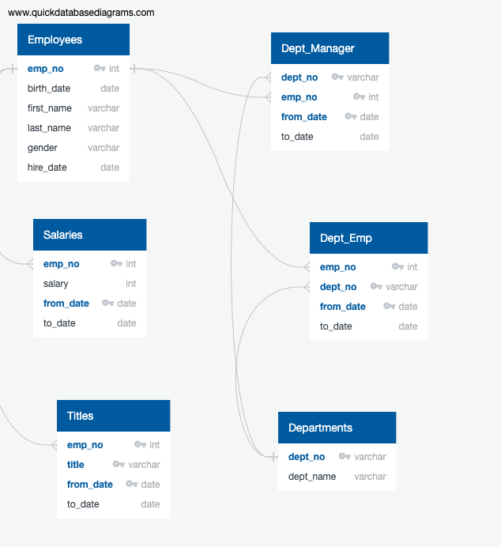
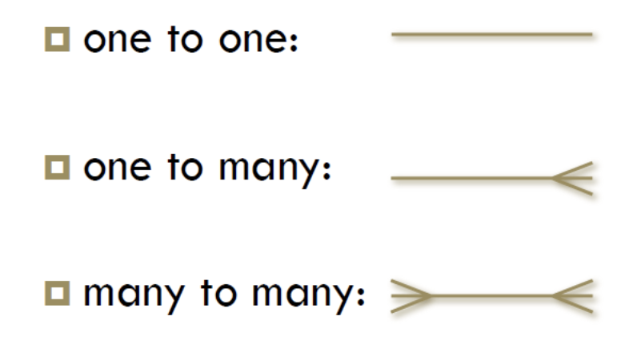
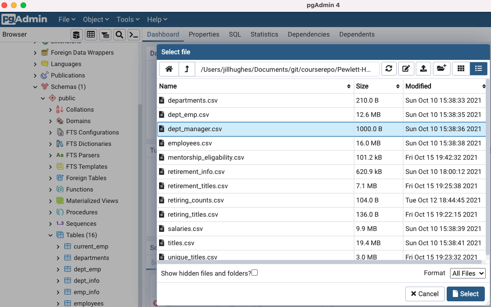
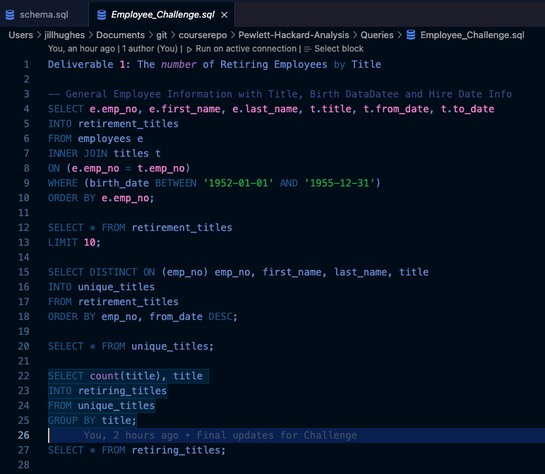

Pewlett-Hackard-Analysis
# Pewlett Hackard Analysis

## Overview
"Pewlett-Hackard is a large company boasting several thousand employees and it's been around for a long time.  As baby boomers begin to retire at a rapid rate Pewlett-Hackard is looking toward the future in two ways. First, it's offering a retirement package for those who meet certain criteria. Second, it's starting to think about which positions will need to be filled in the near future.  The number of upcoming retirements will leave thousands of job openings. What would happen to a company if they didn't look ahead and prepare for this many vacancies?  It probably wouldn't be pretty.  

Bobby is an up and coming HR Analyst whose task is to perform employee research. Specificially, he need to find answers to the following questions, Who will be retiring in the next few years, and how many positions will Pewlett-Hackard need to fill?  This analysis will help future-proof Pewlett Hackard by generating a list of all employees eligible for the retirement package.  The employee data Bobby needs is only available in the form of six CSV files because Pewlett Hackard has been mainly using Excel and VBA to work with their data.  But now they've finally decided to update their methods and instead use SQL, a definite upgrade considering the amount of data.  Your task is to help Bobby build an employee database with SQL by applying your data modelling, engineering, and analysis skills."  _Module 7.0.4 Welcome to Pewlett Hackard_

---
## Process and Results

### Resources
* Data Source: employees.csv, departments.csv, titles.csv, salaries.csv, dept_managers.csv, dept_emp.csv
* Software: Visual Studio 1.61.1, pgAdmin 4, Postgresql 14

### Process

#### _**Entity Relationship Diagram**_ diagram was developed based on the data provided in the 6 CSV files. Once a design of how these 6 CSV files related to each other and the design was agreed upon, the schema of the database was written in SQL and the database was created with the tables based off of the **ERD**.

* _Entity Relationship Design_ :  
    * Each box represents each CSV file, showing the column headers in each file, and the datatype of the data in each column. This will become a _Table_ in the Database.
    * Lines from one one _Table_ to each other show the column that matches in each table that defines the _relationship_. 
 

* Entity Relationship Markers
    * one to one:    example:  each employee has one desk and each desk is assigned to one employee
    * one to many:   example:  one manager to many employees and one department holds many employees
    * many to many:  example:  many departments are in many locations and many locations hold many departments

----
#### Creation of the tables - SQL

---

#### Import of the CSV Files

Once the tables were created with the _schema.sql_, the next step was to go into _pgAdmin_, right click onto the corresponding table, and choose Import/Export. The pop-up window would come up, you choose the file, and let the system know that there are headers in the file and that the file uses commas as column separaters.  The application would then upload the data into the system and you can then verify that the data all uploaded with a simple _select count(*) from table_name;_

This was repeated for all tables and our 6 CSV files were now in a database!

---

#### Creation of the retirement tables

---

Overview of the analysis: Explain the purpose of this analysis.
Results: Provide a bulleted list with four major points from the two analysis deliverables. Use images as support where needed.
Summary: Provide high-level responses to the following questions, then provide two additional queries or tables that may provide more insight into the upcoming "silver tsunami."
How many roles will need to be filled as the "silver tsunami" begins to make an impact?
Are there enough qualified, retirement-ready employees in the departments to mentor the next generation of Pewlett Hackard employees?
Deliverable 3 Requirements
Structure, Organization, and Formatting (6 points)
The written analysis has the following structure, organization, and formatting:

There is a title, and there are multiple sections. (2 pt)
Each section has a heading and subheading. (2 pt)
Links to images are working and displayed correctly. (2 pt)
Analysis (14 points)
The written analysis has the following:

Overview of the analysis:

The purpose of the new analysis is well defined. (3 pt)
Results:

There is a bulleted list with four major points from the two analysis deliverables. (6 pt)
Summary:

The summary addresses the two questions and contains two additional queries or tables that may provide more insight. (5 pt)
