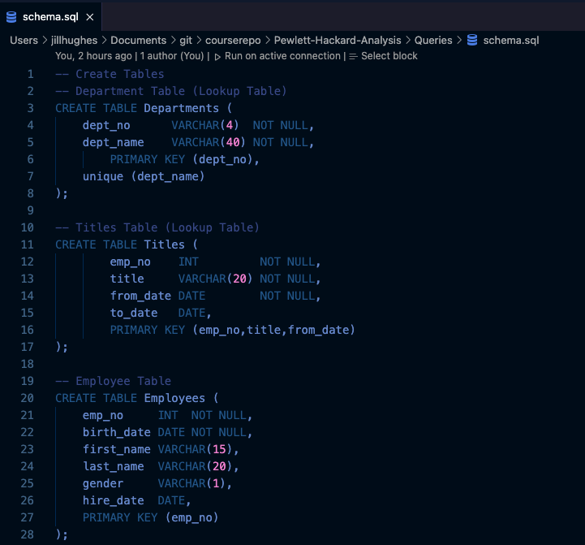

Pewlett-Hackard-Analysis
# Pewlett Hackard Analysis


## Overview
"Pewlett-Hackard is a large company boasting several thousand employees and it's been around for a long time.  As baby boomers begin to retire at a rapid rate Pewlett-Hackard is looking toward the future in two ways. First, it's offering a retirement package for those who meet certain criteria. Second, it's starting to think about which positions will need to be filled in the near future.  The number of upcoming retirements will leave thousands of job openings. What would happen to a company if they didn't look ahead and prepare for this many vacancies?  It probably wouldn't be pretty.  

Bobby is an up and coming HR Analyst whose task is to perform employee research. Specificially, he need to find answers to the following questions, Who will be retiring in the next few years, and how many positions will Pewlett-Hackard need to fill?  This analysis will help future-proof Pewlett Hackard by generating a list of all employees eligible for the retirement package.  The employee data Bobby needs is only available in the form of six CSV files because Pewlett Hackard has been mainly using Excel and VBA to work with their data.  But now they've finally decided to update their methods and instead use SQL, a definite upgrade considering the amount of data.  Your task is to help Bobby build an employee database with SQL by applying your data modelling, engineering, and analysis skills."  _Module 7.0.4 Welcome to Pewlett Hackard_

---
## Process and Results

### Resources
* Data Source: employees.csv, departments.csv, titles.csv, salaries.csv, dept_managers.csv, dept_emp.csv
* Software: Visual Studio 1.61.1, pgAdmin 4, Postgresql 14

### Process

#### _**Entity Relationship Diagram**_ diagram was developed based on the data provided in the 6 CSV files. Once a design of how these 6 CSV files related to each other and the design was agreed upon, the schema of the database was written in SQL and the database was created with the tables based off of the **ERD**.


* _Entity Relationship Design_ :  
    * Each box represents each CSV file, showing the column headers in each file, and the datatype of the data in each column. This will become a _Table_ in the Database.
    * Lines from one one _Table_ to each other show the column that matches in each table that defines the _relationship_. 
 


* Entity Relationship Markers
    * one to one:    example:  each employee has one desk and each desk is assigned to one employee
    * one to many:   example:  one manager to many employees and one department holds many employees
    * many to many:  example:  many departments are in many locations and many locations hold many departments

----
#### Creation of the tables - SQL


---

#### Import of the CSV Files


Once the tables were created with the _schema.sql_, the next step was to go into _pgAdmin_, right click onto the corresponding table, and choose Import/Export. The pop-up window would come up, you choose the file, and let the system know that there are headers in the file and that the file uses commas as column separaters.  The application would then upload the data into the system and you can then verify that the data all uploaded with a simple _select count(*) from table_name;_

This was repeated for all tables and our 6 CSV files were now in a database!

---

#### Creation of the retirement tables


Once we had the employee database established, now it was time to begin our work.  We needed to first create our retirement tables!  So now it was time to determine the "WHO" that were eligable for retiring in the next few years.  Then determine what jobs and the quantity of jobs we need to start looking at replacing.

1) Find the employees: emp_no, first_name, last_name, title, hire_date, to_date (are they still working here), that have a birth_date from 1952-1955?
```
SELECT e.emp_no, e.first_name, e.last_name, t.title, t.from_date, t.to_date
INTO retirement_titles
FROM employees e
INNER JOIN titles t
ON (e.emp_no = t.emp_no)
WHERE (birth_date BETWEEN '1952-01-01' AND '1955-12-31')
ORDER BY e.emp_no;
```
2) Find the current job of these employees that are retiring.
```
SELECT DISTINCT ON (emp_no) emp_no, first_name, last_name, title
INTO unique_titles
FROM retirement_titles
ORDER BY emp_no, from_date DESC;
```
3) Find the number of jobs we will be looking at replacing in the next few years.
```
SELECT count(title), title 
INTO retiring_titles
FROM unique_titles
GROUP BY title;
```
4) Plan to find current employees, born in 1965 and offer them an opportunity to be mentored now before these valuable employees leave, so their knowledge is transferred.
```
SELECT DISTINCT ON (e.emp_no) e.emp_no, e.first_name, e.last_name, e.birth_date, 
    de.from_date, de.to_date, t.titles
INTO mentorship_eligibility
FROM employees e
INNER JOIN dept_emp de
ON (e.emp_no = de.emp_no)
INNER JOIN titles t
ON (e.emp_no = t.emp_no)
WHERE (birth_date BETWEEN '1965-01-01' AND '1965-12-31')
  AND de.to_date = '9999-01-01'
ORDER BY e.emp_no;
```

#### Export of the CSV Files


---
## Results:

* _How many employees are in the "silver tsunami"?_ 
 
    * The number of employees that can retire, relatively soon, is quite high, the total is: 90,398, which is 37.65% of their total laborforce. This is quite substantial. 

* _How many positions are in the "silver tsunami"?_

    * As you can see from the table below, the heaviest hitting positions are the Senior Staff and Senior Engineer positions.  Those alone make up 57,570 positions, or 64% of the retirement pool of the "silver tsunami".  That is quite a bit of knowledge leaving Pewlett Hackard.
 
  
    
* _Do we have on hand ready staff to take over the majority of these positions?_

    * If we base the numbers on the existing rules of the Mentorship Program, then no, we do not have enough employees in the mentorship program. The numbers are just too low, based on the numbers of retiree's.
    


---

## Summary

Based on the analysis of the employee data, more programs will have to be implemented to perform the following:

*  Prepare each department for the upcoming departures for their Senior Staff members
    * Training on all areas of expertise and transfer of knowledge to a minimum of 2 people
    * Mentoring of staff of their expertise
    
*  Increase of eligability requirements for more employees to join the Mentorship Program
    * This will help with the immediate need for transfer of knowledge in all departments
    
*  Evaluations of what positions these Mentorships will fill, based on the timeline of the Retiree, and progress reports of the Mentee.
*  Immediate job postings for those positions we can fill internally, and promote within.
*  Immediate job postings for positions looking for candidates outside Pewlett Hackard.

The management really needs to focus on plans to backfill these positions with trained staff before this amount of staff leave.  As you can see from the table above, the numbers are quite high in Senior Staff and Senior Engineer positions.  This makes sense as it takes years in the position to earn this level. Fresh out of college or even 10 years out of college does not qualify you for a Senior level position. 

That is why I believe the Pewlett Hackard new Mentoring program, placing Midlevel staff members with Senior Level staff members is the best way to mentor these collegues to take over the Senior level staff positions as they retire. 

Jill Hughes
